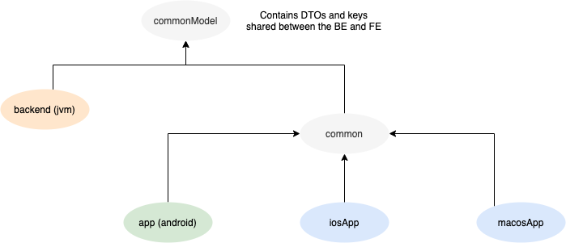

# Multiplatform Playground (AppPortfolio)

A **Kotlin Multiplatform** project with the purpose of experimenting with and providing a possible direction to newcomers having questions about *tech stack*, *project setup*, *architectural decisions* in a KMP environment.

#### Note:

It's primary purpose is to showcase sharing every layer except the UI layer in between multiple platforms, so shared **Presentation layer** using the MVVM pattern, shared **Domain** and **Data layers** (UseCase, Repositories, Entities, etc.).

 If sharing ViewModel logic is out of scope for you, then consider checking out the following repositorys:

- https://github.com/joreilly/PeopleInSpace
- https://github.com/touchlab/KaMPKit
- https://github.com/joreilly/BikeShare

### Shared pieces

- Every layer except UI (so ViewModel, UseCase, Repository layers)
- Localization
- DI
- Shared DTOs (between Backend & Clients)

### Tech stack

- Declarative UI with `Jetpack Compose` and `SwiftUI`
- [Koin](https://github.com/InsertKoinIO/koin)
- [Ktor](https://ktor.io/) (Backend + Client logic)
- [Kotlinx-serialization](https://github.com/Kotlin/kotlinx.serialization)
- [SqlDelight](https://github.com/cashapp/sqldelight)
- [Moko-Resources](https://github.com/icerockdev/moko-resources) (Localization)

### Targets

- JVM (Backend)
- Android
- iOS
- macOS (Coming soon)
- desktop (planned)
- web (planned)

### Module Hierarchy

### Further Development

- Shared testing (currently android only, [Mockk K/N support](https://github.com/mockk/mockk/issues/58))
- Supporting more targets